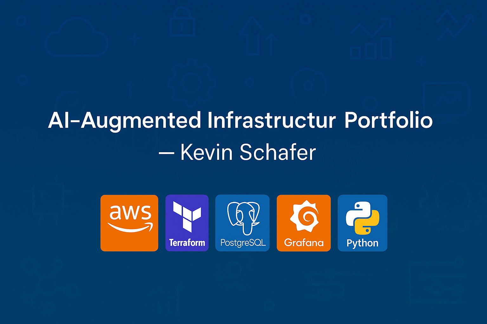

<!-- Top Banner -->


# 🚀 AI-Augmented Infrastructure Portfolio – Kevin Schafer

**Director** • Cloud Infrastructure • Database Modernization • AI-Augmented Operations  


---

Welcome! I’m **Kevin Schafer**, an infrastructure leader and AI-aware strategist with **30+ years in IT and cloud transformation**.

This portfolio showcases **real-world micro-projects**, **architecture diagrams**, and **automation scripts** I’ve developed to demonstrate modern infrastructure capabilities — from **FinOps** and **DevSecOps** to **ML workload readiness**.

---

## 🗂 Project Index

| Icon | Project | Description |
| --- | --- | --- |
| 🔍 | [AI-Powered Observability](./ai-observability) | CloudWatch + ChatGPT incident triage simulation with flowcharts |
| 💸 | [FinOps Automation](./finops-automation) | Python + GPT-4 to identify and summarize cost-saving actions |
| 🔐 | [Compliance-as-Code](./compliance-as-code) | Terraform + GPT drift detection and policy enforcement |
| 🧠 | [ML Infra Simulation](./ml-infra) | AI-ready SageMaker pipeline with tagging and encryption |
| 📊 | [Kubernetes Observability Stack](./k8s-observability) | EKS + Prometheus + Grafana dashboards for DB latency and alerts |
| 🏗 | [Platform Maturity Model](./platform-strategy) | Golden paths, OKRs, and developer velocity strategy deck |

---

## 📂 Folder Structure
```plaintext
/ai-observability/
  ├── cloudwatch-alarm-sim.md
  ├── gpt-response.md
  └── flowchart.png

/finops-automation/
  ├── boto3-script.py
  ├── gpt-summary.md
  └── cost-dashboard.pptx

/compliance-as-code/
  ├── terraform-drift.tf
  ├── gpt-policy.md
  └── remediation-diagram.png

/ml-infra/
  ├── sagemaker-deploy.md
  └── security-architecture.png

/k8s-observability/
  ├── helm-values.yaml
  └── grafana-dashboard.json

/platform-strategy/
  ├── maturity-model.pdf
  └── platform-okrs.md

